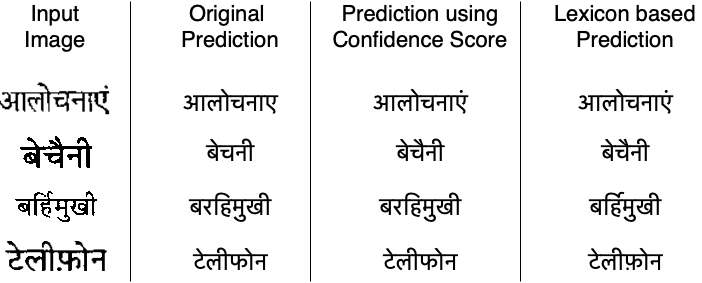
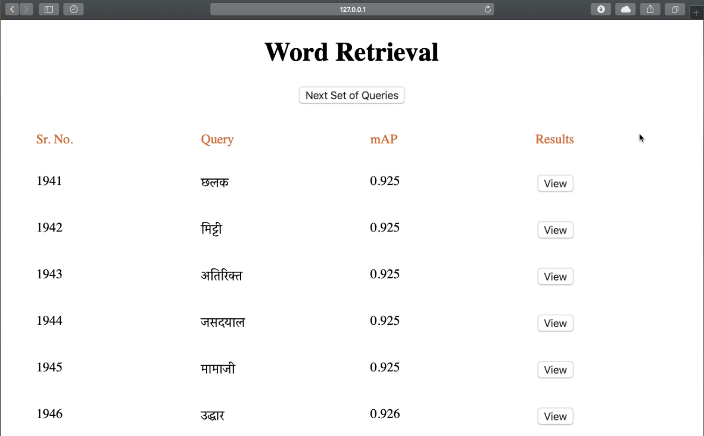

Fused Text Recogniser and Deep Embeddings Improve Word Recognition and Retrieval
=================================================================================
[](http://arxiv.org/abs/2007.00166)
[](LICENSE)

### [Project page](https://sid2697.github.io/Word-recognition-and-retrieval/) | [Paper](https://arxiv.org/pdf/2007.00166.pdf) | [Demonstration](https://sid2697.github.io/files/Word_Retrieval_demo.gif) | [Poster](https://sid2697.github.io/files/Siddhant_Bansal_V4.pdf) | [Springer](https://link.springer.com/chapter/10.1007/978-3-030-57058-3_22)

This repository contains code for the paper

"**Fused Text Recogniser and Deep Embeddings Improve Word Recognition and Retrieval**" *[Siddhant Bansal](https://sid2697.github.io), [Praveen Krishnan](https://kris314.github.io), [C.V. Jawahar](https://faculty.iiit.ac.in/~jawahar/index.html)* 
published in DAS 2020.

## Word Recognition Results
<!-- ----------- -->


## Word Retrieval Demonstration
<!--  -->

<!-- ----------- -->
Click on the image to play the video.

[](https://youtu.be/3_InpQoJCMg)

Usage
-----------
### Cloning the repository
```
git clone https://github.com/Sid2697/Word-recognition-and-retrieval.git
```
### Install Pre-requisites
- Python >= 3.5
- PyTorch
- Scikit-learn
- NumPy
- tqdm

**`requirements.txt`** has been provided for installing Python dependencies.

```sh
pip install -r requirements.txt
```
### Generating/using deep embeddings
The deep embeddings used in this work are generated using the End2End network proposed in:
```
Krishnan, P., Dutta, K., Jawahar, C.V.: Word spotting and recognition using deep embedding. In: 2018 13th IAPR International Workshop on Document Analysis Systems (DAS). pp. 1–6 (April 2018). https://doi.org/10.1109/DAS.2018.70
```
Word text and image's deep embeddings for testing this repository are provided in the ``embeddings`` folder.
Text files containing the information about the embeddings are required while running the code. They are in the format<br>
```
<img1-path><space><text1-string><space><dummyInt><space>1
<img2-path><space><text2-string><space><dummyInt><space>1
...
```
One can refer to and use [https://github.com/kris314/hwnet](https://github.com/kris314/hwnet) for generating embeddings.

For the purpose of making it easier to explore the code in this repository, sample text files and embeddings are provided in ``gen_files`` and ``embeddings``, respectively.

Original Dataset used in this work will be released by [CVIT](http://cvit.iiit.ac.in) soon.

### Running the code
For running word recognition use the command:
```sh
python word_recognition.py
```
For running word recognition with confidence score use the command:
```sh
python word_recognition.py --use_confidence=True
```
Other arguments for word recognition experiment are:
```sh
--image_embeds
--topk_embeds
--predictions_file
--image_file
```
- `image_embeds` is used to provide path to the image embeddings
- `topk_embeds` is used to provide path to the TopK predictions' embeddings
- `image_file` is used to provide path to the image's text information file
- `predictions_file` is used to provide path to the TopK predictions' text information file

For running word retrieval use the command:
```sh
python word_retrieval.py
```
For running word retrieval's naive merge experiment use the command:
```sh
python word_retrieval.py --experiment_label=naive_merge
```
Other options for `experiment_label` are: `ocr_rank` and `query_expand`

Other major arguments for word retrieval experiment are:
- `text_features` is used to provide path to the text embeddings
- `image_features` is used to provide path to the image embeddings
- `annotations_path` is used to provide path to the text file containing annotations
- `ocr_opt_path` is used to provide path to the text file containing OCR predictions

License and Citation
---------------------

The software is licensed under the MIT License. If you find this work useful, please cite the following paper:

```
@InProceedings{10.1007/978-3-030-57058-3_22,
author="Bansal, Siddhant and Krishnan, Praveen and Jawahar, C. V.",
title="Fused Text Recogniser and Deep Embeddings Improve Word Recognition and Retrieval",
booktitle="Document Analysis Systems",
year="2020",
publisher="Springer International Publishing",
pages="309--323",
isbn="978-3-030-57058-3"
}
```

Contact
-----------
In case of any query contact [Siddhant Bansal](https://sid2697.github.io).
