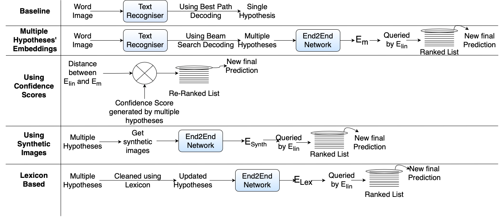
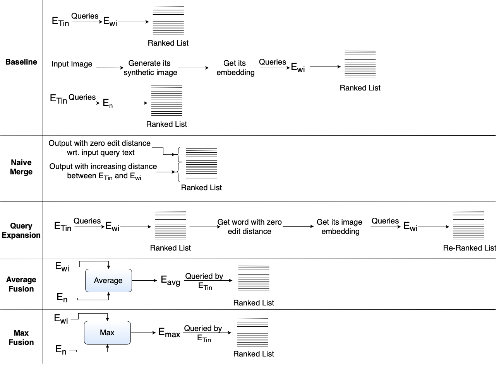
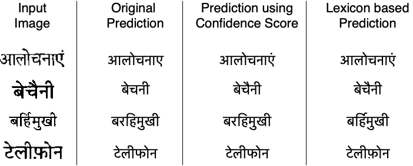

Fused Text Recogniser and Deep Embeddings Improve Word Recognition and Retrieval
=================================================================================
<!-- TODO: Add the link to archive paper -->
<!-- [](http://arxiv.org/abs/1908.05849) -->
[](LICENSE)

### [Project page]() | [Demonstration](https://sid2697.github.io/files/Word_Retrieval_demo.gif) | [Poster](https://sid2697.github.io/files/Siddhant_Bansal_V4.pdf) | Paper

This repository contains code for the paper

"**Fused Text Recogniser and Deep Embeddings Improve Word Recognition and Retrieval**" *[Siddhant Bansal](https://sid2697.github.io), [Praveen Krishnan](https://kris314.github.io), [C.V. Jawahar](https://faculty.iiit.ac.in/~jawahar/index.html)* 
<!-- TODO published in DAS 2020 -->

Table of contents:
-----------

- [About the project](#about-the-project)
- [Summary](#summary)
- [Results](#results)
    - [Word Recognition](#word-recognition)
    - [Word Retrieval](#word-retrieval)
- [Usage](#usage)
    - [Install Pre-requisites](#install-pre-requisites)
    - [Generating/using deep embeddings](#generating/using-deep-embeddings)
    - [Running the code](#running-the-code)
- [Contact](#contact)

About the project
-----------
This project was a part of my research work at [CVIT](http://cvit.iiit.ac.in), [IIIT-Hyderabad](https://www.iiit.ac.in) with [Dr Praveen Krishnan](https://kris314.github.io) and [Dr C.V. Jawahar](https://faculty.iiit.ac.in/~jawahar/index.html). This project aimed to devise novel methods to improve word recognition and retrieval by exploiting the best attributes of text recogniser system and deep embeddings.

Summary
-----------
Recognition and retrieval of textual content from the large document collections have been a powerful use case for the document image analysis community. Often the word is the basic unit for recognition as well as retrieval. Systems that rely only on the text recogniser’s (OCR) output are not robust enough in many situations, especially when the word recognition rates are poor, as in the case of historic documents or digital libraries. An alternative has been word spotting based methods that retrieve/match words based on a holistic representation of the word. In this paper, we fuse the noisy output of text recogniser with a deep embeddings representation derived out of the entire word. We use average and max fusion for improving the ranked results in the case of retrieval. We validate our methods on a collection of Hindi documents. We improve word recognition rate by 1.4% and retrieval by 11.13% in the mAP.


<!-- TODO Add link -->
Methods used for improving word recognition. For more details refer [paper]().



<!-- TODO Add link -->
Methods used for improving word retrieval. For more details refer [paper]().

Results
-----------
### Word Recognition



### Word Retrieval


Usage
-----------
### Cloning the repository
```
git clone https://github.com/Sid2697/Word-recognition-and-retrieval.git
```
### Install Pre-requisites
- Python3
- PyTorch
- Scikit-learn
- NumPy
- tqdm

**`requirements.txt`** has been provided for installing Python dependencies.

```sh
pip install -r requirements.txt
```
### Generating/using deep embeddings
The deep embeddings used in this work are generated using the End2End network proposed in:
```
Krishnan, P., Dutta, K., Jawahar, C.V.: Word spotting and recognition using deep embedding. In: 2018 13th IAPR International Workshop on Document Analysis Systems (DAS). pp. 1–6 (April 2018). https://doi.org/10.1109/DAS.2018.70
```
Word text and image's deep embeddings for testing this repository are provided in the ```embeddings``` folder.
Text files containing the information about the embeddings are required while running the code. They are in the format<br>
```<img1-path><space><text1-string><space><dummyInt><space>1```<br>
```<img2-path><space><text2-string><space><dummyInt><space>1```<br>
...<br>
Corresponding text files for testing this repository are provided in the ``gen_files`` folder.

### Running the code
For running word recognition use the command:
```sh
python3 word_recognition.py
```
For running word recognition with confidence score use the command:
```sh
python3 word_recognition.py --use_confidence=True
```
Other agruments for word recognition experiment are:
```sh
--image_embeds
--topk_embeds
--predictions_file
--image_file
```
- `image_embeds` is used to provide path to the image embeddings
- `topk_embeds` is used to provide path to the TopK predictions' embeddings
- `image_file` is used to provide path to the image's text information file
- `predictions_file` is used to provide path to the TopK predictions' text information file

For running word retrieval use the command:
```sh
python3 word_retrieval.py
```
For running word retrieval's naive merge experiment use the command:
```sh
python3 word_retrieval.py --experiment_label=naive_merge
```
Other options for `experiment_label` are: `ocr_rank` and `query_expand`

Other major arguments for word retrieval experiment are:
- `text_features` is used to provide path to the text embeddings
- `image_features` is used to provide path to the image embeddings
- `annotations_path` is used to provide path to the text file containing annotations
- `ocr_opt_path` is used to provide path to the text file containing OCR predictions

Contact
-----------
In case of any query contact Siddhant Bansal, [siddhant.bansal@students.iiit.ac.in](siddhant.bansal@students.iiit.ac.in)
<!-- TODO Add citation information -->
